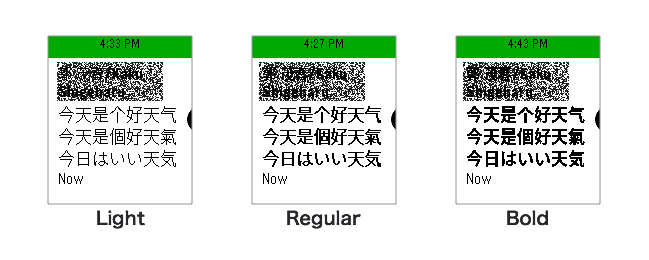

# pebble-font-japanese-archive
Archive of Kuro's Japanese supported Pebble Font.

These can still be used with Pebble watches running Rebble software as of 2024 (See https://rebble.io/). Long live Pebble!

**Acknowledgement:** Big thanks to Kuro for these resources! It has helped make many people happy.

**Archive Source:** https://archive.is/0m5x1

**Creator:** kuro.ro

Ver.5:
- [pblp_zhs_zht_ja_v5_light_font_weight.pbl](https://www.dropbox.com/s/mk1e21f917fxn56/pblp_zhs_zht_ja_v5_light.pbl?dl=0)
- [pblp_zhs_zht_ja_v5_regular_font_weight.pbl](https://www.dropbox.com/s/szcuu1h25hk4rre/pblp_zhs_zht_ja_v5_regular.pbl?dl=0)
- [pblp_zhs_zht_ja_v5_bold_font_weight.pbl](https://www.dropbox.com/s/ep76dhllzwzsd6v/pblp_zhs_zht_ja_v5_bold.pbl?dl=0)

Ver.4:
- [pblp_zhs_zht_ja_v4_light_font_weight.pbl](https://www.dropbox.com/s/7e8frttdj6fcds5/pblp_zhs_zht_ja_v4_light.pbl?dl=0)
- [pblp_zhs_zht_ja_v4_regular_font_weight.pbl](https://www.dropbox.com/s/5qjocmbvo6vhtba/pblp_zhs_zht_ja_v4_regular.pbl?dl=0)
- [pblp_zhs_zht_ja_v4_bold_font_weight.pbl](https://www.dropbox.com/s/hmogqkleocna7r0/pblp_zhs_zht_ja_v4_bold.pbl?dl=0)

Ver.3
- [pblp_zhs_zht_ja_v3_light_font_weight.pbl](https://www.dropbox.com/s/5y76ily84itbwd0/pblp_zhs_zht_ja_v3_light.pbl?dl=0)
- [pblp_zhs_zht_ja_v3_regular_font_weight.pbl](https://www.dropbox.com/s/dwldkqb97zj227o/pblp_zhs_zht_ja_v3_regular.pbl?dl=0)
- [pblp_zhs_zht_ja_v3_bold_font_weight.pbl](https://www.dropbox.com/s/datatl0nb4u6con/pblp_zhs_zht_ja_v3_bold.pbl?dl=0)

Ver.2
- [pblp_zhs_zht_ja_v2_light_font_weight.pbl](https://www.dropbox.com/s/hh45kt7aha6ikjf/pblp_zhs_zht_ja_v2_light.pbl?dl=0)
- [pblp_zhs_zht_ja_v2_regular_font_weight.pbl](https://www.dropbox.com/s/qum1jide0w31v21/pblp_zhs_zht_ja_v2_regular.pbl?dl=0)

Ver.1
- [pblp_zhs_zht_ja_v1.pbl](https://www.dropbox.com/s/sl2pkmbraruycxo/pblp_zhs_zht_ja_v1.pbl?dl=0)

---

Following information is from the original website

# Pebble Time 日本語・中国語言語パック

> # R.I.P Pebble

現在Pebble Timeの3.0 firmwareは英語のみでCJKに対応していない。無印のPebbleは[中国語対応](https://blog.getpebble.com/2015/03/17/chn-localized/)の公式beta firewareが存在するようだが、なぜかTimeのほうは対応していない。日本語の公式対応は近いうちにも予定がなさそう。（日本人のPebblerがまだまだ少ないからかな？）

ネットで調べたところ、中国語、日本語は自作の言語パックが存在するらしい。それぞれインストールしてみたが、どうも前にインストールされたパックは上書きされる仕様になっているので、複数の言語を同時に対応することができない。しかも、無印Pebbleのために作ったもののせいか、メニューの翻訳が不完全で、英語と中国語or日本語が混在している。で、以上の問題を解決するため[日本語言語パック](https://wh.to/pebble/index_jp.html)と[中国語パック](https://forums.getpebble.com/discussion/21442/no-chinese-in-language-setting/p1)の漢字ライブラリーを借りて自分で中国語・日本語言語パックを作った。バイリンガルなPebble、是非使ってみてください。

> 注意：これはPebble Time専用の言語パック。無印PebbleのRAMが小さいため、インストールしても正常に動作しない可能性が高い。~~また、インストールはAndroid端末で行ってください、iOS端末ではインストールできません。~~
> 注意：本語言包只可以用在Pebble Time，初代Pebble不保證支持。另外，安裝請使用Andorid，iOS app目前不支持安裝語言包。

## Update Info

### version 5
- 幾つ漏れていた漢字を追加、現在対応字数10,375
- Regular、boldの14ptフォントのウェイトを変更、通知リストの小さい文字がもっと見やすくなった

### version 4
- 幾つ漏れていた漢字を追加、現在対応字数10,342
- Regular、Lightの使用フォントを変更。 RegularはYao Weiさんが手を加えたスクリプトでGoogle Noto Sans CJK Thinをベースに作成。よりスムーズなフォント表示を実現

### version 3
- 幾つ漏れていた漢字を追加、現在対応字数10,265
- Bold、Regular、Light3つのフォントウェイトのパックを提供

### version 2
- 文字を最適なサイズに調整（1行7文字）
- 14pt,28ptフォントの対応漢字数を他のサイズのフォントと同様10,250字に増加
- RegularとLight2つのフォントウェイトのパックを提供
- パック容量の削減

### version 1
- 操作メニューの言語が英語のまま
- 通知やアプリでの文字表示が日本語、中国語簡体字、中国語繁体字に対応
- 14ptフォントは漢字3,000字、18pt,24ptフォントは漢字10,250字、28ptフォントは漢字4,000字に表示対応
- 通常フォントはGoogle Noto Sans CJK Demilight、BoldフォントはGoogle Noto Sans CJK Regularを使用

## Usage
- 言語パックをDLしdropboxなどクラウドサービスにアップロードする
- 最新のPebble Timeアプリでパックを開く （Adroidのみ）
- 開いたらインストールが自動で開始される
- プログレスバーが100%になったら言語パック適用完了

## Future Work
- ~~14ptフォントの漢字表示数を増やす~~
- ~~現在の表示フォントはちょっと大きい気がするので、最適なサイズに調整~~

## Reference
- [xndcn’s firmware utils](https://github.com/xndcn/pebble-firmware-utils)
- [Something about Language Pack File](https://forums.getpebble.com/discussion/21716/something-about-language-pack-file%23latest)
- [No Chinese in language setting - No.5 post by seikan](https://forums.getpebble.com/discussion/21442/no-chinese-in-language-setting/p1)
- [Pebble日本語言語パック](https://wh.to/pebble/index_jp.html)
